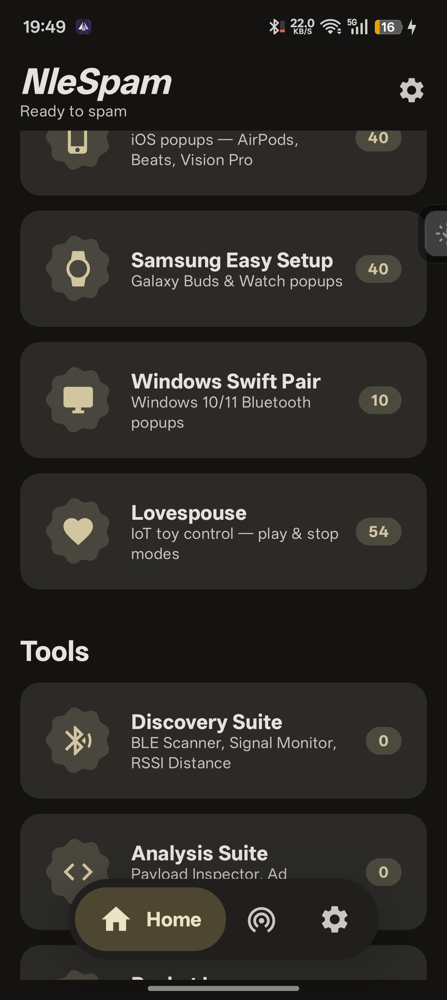

# NleSpam

**NleSpam** (formerly BleDroid) is an advanced Android application demonstrating **Bluetooth Low Energy (BLE) advertising and scanning** techniques. 

### Disclaimer
**This project is for educational and research purposes only.** Do not use it for malicious activities, denial-of-service (DoS) attacks, or any actions that violate local laws or regulations. The author and contributors assume no liability for misuse.

## Features
- **Multi-Tool Suites**: Organized into Discovery and Analysis suites for efficient testing.
- **Payload Generators**: Apple Continuity, Samsung Easy Setup, Google Fast Pair, Windows Swift Pair, AirTag Clone, and more.
- **Future-Proof**: Built against **Android SDK 37** (Android 16/17 ready), utilizing modern `connectedDevice` Foreground Service types.
- **R8 Optimized**: Built with R8 for optimal performance and minimal APK size.

## Requirements
- Android 8.0+ (API 26+)
- BLE hardware support

## Screenshots


## Maintenance
**This is my personal side-project.** I will rarely provide bug fixes or active maintenance myself, as I am focused on other projects. 
However, **Pull Requests (PRs) are highly encouraged and will be reviewed.** You may also open Issues, but please use the provided templates and understand that community PRs are the primary way this project will move forward.

## Building from source
```bash
./gradlew clean assembleRelease
```
The APK will be available in `app/build/outputs/apk/release/app-release.apk`.

*Note: The keystore used for signing the provided release builds is not included in this repository. You must generate your own if compiling from source.*

## Credits
This project is a heavily modified and optimized fork of the original [HBLE-Droid](https://github.com/HmnDev-Tech/HBLE-Droid) by HmnDev-Tech.

## Fork Author
Forked and maintained by [kerneldroid](https://github.com/kerneldroid).